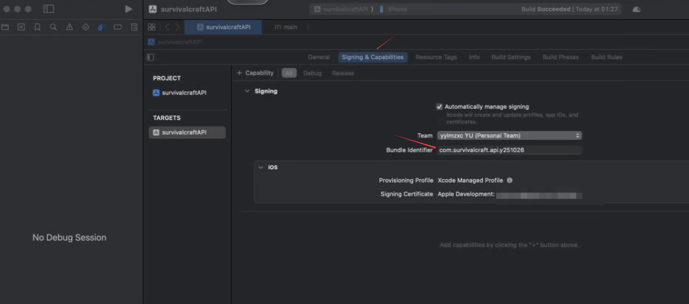

# SurvivalCraft-API iOS Plugin Version

## Project Introduction
SurvivalCraft-API is a plugin development framework for the iOS version of the SurvivalCraft game. It provides a complete set of API interfaces that enable developers to create and develop plugins for the iOS version of SurvivalCraft.

## System Requirements

### Windows Development Machine
- Visual Studio 2022
- Xamarin.iOS development components
- .NET development environment

### Mac Build Machine
- macOS 11.0 or higher
- Xcode 13.0 or higher
- Apple Developer account

## Environment Configuration

### 1. Resource File Preparation
Package the Windows platform resource files:

```bash
# Package the Survivalcraft.Windows\Content directory into a zip file
```

### 2. Project Preparation

1. Open the solution file using Visual Studio 2022:
   ```
   SurvivalcraftApi.sln
   ```

2. Build the Windows platform debug version (important step):
   - Set `Survivalcraft.Windows` as the startup project
   - Select Debug configuration and x86/x64 platform
   - Build the solution
   
   *Note: This step is necessary. Skipping it may cause resource file loss in the iOS version, resulting in a white screen issue.*

### 3. macOS Environment Configuration

#### Project Creation and Bundle Identifier Setup

1. When creating a project in Xcode, ensure that the Bundle Identifier setting is consistent with the CFBundleIdentifier in Info.plist
2. Recommended Bundle Identifier format: `com.survivalcraft.api.y251026`
3. Please refer to the following screenshot for configuration:



#### Certificate and Provisioning Profile Management

1. View currently available signing certificates:
   ```bash
   security find-identity -p codesigning
   ```

2. View local provisioning profiles:
   ```bash
   ls -lh /Users/[username]/Library/MobileDevice/Provisioning\ Profiles/
   ```

3. View Xcode login account cache:
   ```bash
   ls -lh /Users/[username]/Library/Preferences/com.apple.dt.Xcode.plist
   ls -lh /Users/[username]/Library/Developer/Xcode/UserData/
   ```

#### Clean Up Old Account Information (If Switching Developer Accounts)

1. Delete old account certificates (based on SHA1 value):
   ```bash
   security delete-identity -Z <old certificate SHA1>
   ```

2. Delete old provisioning profiles:
   ```bash
   rm -rf /Users/[username]/Library/MobileDevice/Provisioning\ Profiles/*
   ```

3. Clear Xcode login information:
   ```bash
   rm -f /Users/[username]/Library/Preferences/com.apple.dt.Xcode.plist
   rm -rf /Users/[username]/Library/Developer/Xcode/UserData/Provisioning\ Profiles
   rm -rf /Users/[username]/Library/Developer/Xcode/UserData/XcodeCloud
   ```

#### Resolving Visual Studio and Xcode Provisioning Profile Path Inconsistency

Newer versions of Xcode have changed the storage location of provisioning profiles. To ensure Visual Studio can find the provisioning profiles correctly, we need to create a symbolic link:

```bash
# Delete the old folder if it exists
rm -rf ~/Library/MobileDevice/Provisioning\ Profiles

# Create a symbolic link, linking the old location to the new location
ln -s ~/Library/Developer/Xcode/UserData/Provisioning\ Profiles ~/Library/MobileDevice/Provisioning\ Profiles

# Verify the link was created successfully
ls -l ~/Library/MobileDevice/
```

## iOS Project Building

### 1. Connecting to Mac Build Machine
Configure Mac remote building in Visual Studio:
- Navigate to `Tools > iOS > Pair to Mac`
- Enter the Mac's IP address, username, and password
- Wait for the connection to succeed

### 2. Building the iOS Project

1. Set `SurvivalCraft.IOS` as the startup project
2. Select Debug configuration and iPhone Simulator or iOS Device platform
3. Click the build button or press F5 to run

## Common Issues

### 1. Build Failure, Missing Provisioning Profile Error
- Ensure the correct App ID has been created in Apple Developer Portal
- Ensure the latest provisioning profiles have been downloaded in Xcode
- Check if the symbolic link was created correctly

### 2. White Screen After Running
- Ensure the Windows platform version has been built first
- Check if resource files have been packaged and loaded correctly

### 3. Certificate-Related Errors
- Confirm the developer account is valid and not expired
- Check if certificates have been installed correctly on the Mac
- Try cleaning and redownloading certificates and provisioning profiles

## Plugin Development Guide

To develop plugins for the iOS platform, please follow these steps:

1. Create a new Class Library project in the solution
2. Reference the necessary API assemblies
3. Implement plugin interfaces and functionality
4. Place the compiled plugin in the specified directory

For detailed plugin development documentation, please refer to the relevant instructions in the main project.

## License

[Fill in according to the actual license of the project]

## Contact

For any questions or suggestions, please contact the project maintainers through the following methods:

- [Project email or contact information]
- [Project GitHub Issues page]