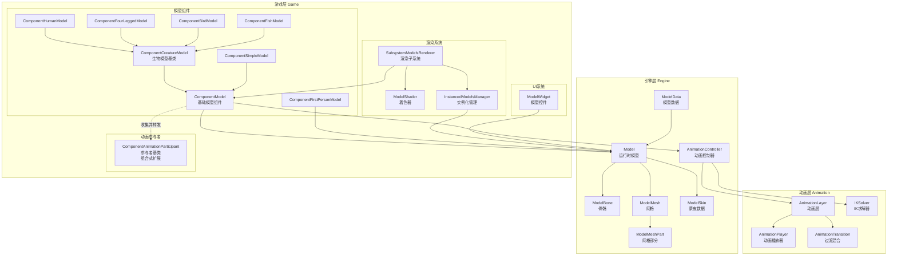
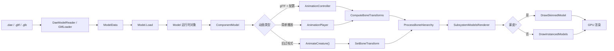
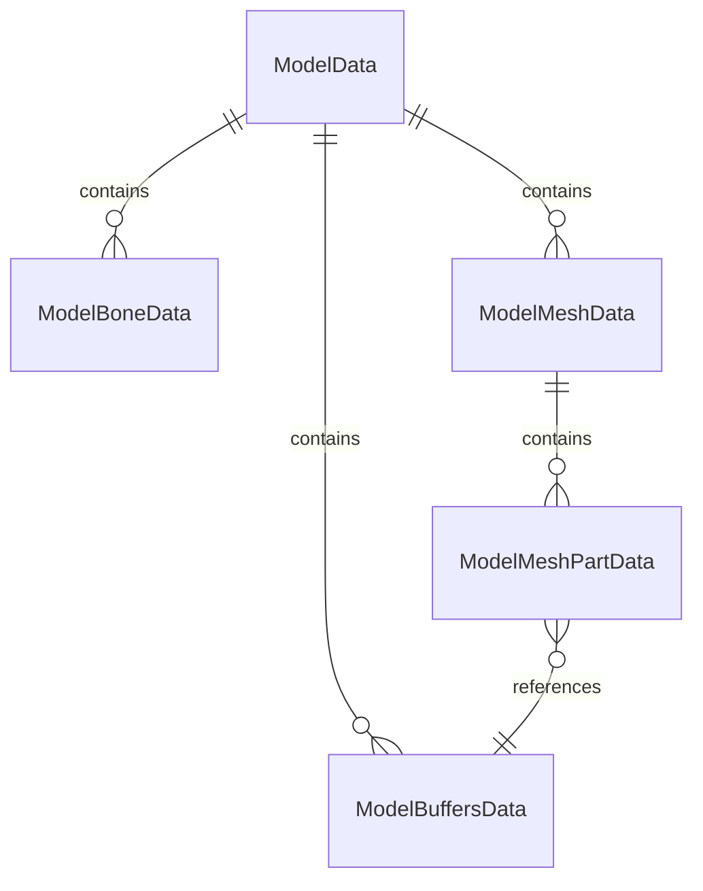
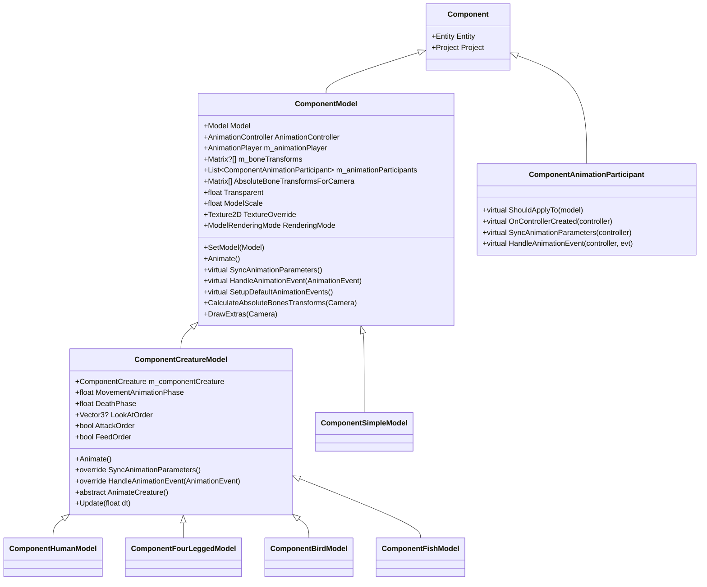
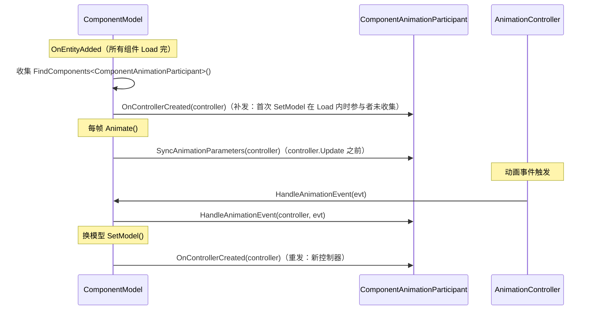
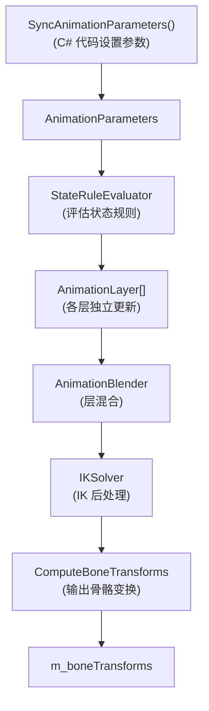
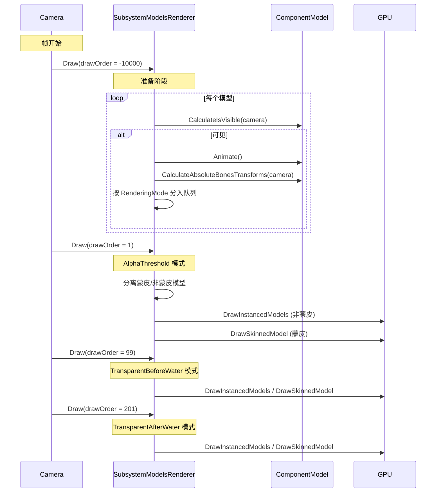
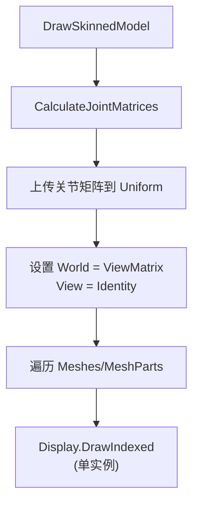
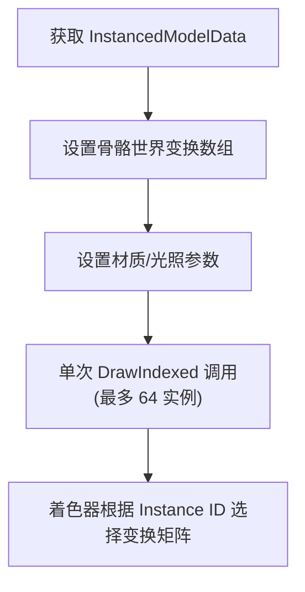

# 生物模型系统技术文档

本文档详细讲解 Survivalcraft 生物 3D 模型系统的数据结构、组件架构、骨骼动画和渲染管线。

## 目录

1. [整体架构概览](#1-整体架构概览)
2. [核心数据结构](#2-核心数据结构)
3. [模型组件体系](#3-模型组件体系)
4. [骨骼动画机制](#4-骨骼动画机制)
5. [渲染管线](#5-渲染管线)
6. [蒙皮渲染](#6-蒙皮渲染)
7. [实例化渲染优化](#7-实例化渲染优化)
8. [各类生物模型实现](#8-各类生物模型实现)
9. [UI模型显示](#9-ui模型显示)

---

## 1. 整体架构概览

### 1.1 系统架构图



### 1.2 核心模块职责

| 模块 | 层级 | 职责 |
|------|------|------|
| **Model** | 引擎层 | 运行时模型容器，管理骨骼层级、网格集合和蒙皮数据 |
| **ModelBone** | 引擎层 | 骨骼节点，树形结构存储变换矩阵 |
| **ModelSkin** | 引擎层 | 蒙皮数据：关节索引、逆绑定矩阵、骨骼根节点 |
| **AnimationController** | 动画层 | 动画控制器：状态规则、层级混合、IK、Root Motion |
| **ComponentModel** | 游戏层 | Entity组件，管理模型渲染状态、动画调度，定义参数同步/事件处理接口并由基类统一转发给参与者 |
| **ComponentCreatureModel** | 游戏层 | 生物模型抽象基类，override 参数同步/事件处理以同步生物参数（接口定义在 ComponentModel） |
| **ComponentAnimationParticipant** | 游戏层 | 动画参与者抽象基类。挂到任意实体参与参数同步、事件处理、控制器就绪通知，组合式替代"继承 override 模型组件" |
| **SubsystemModelsRenderer** | 游戏层 | 模型渲染子系统，管理所有模型的绘制（含蒙皮渲染） |
| **ModelShader** | 游戏层 | 着色器参数封装，支持实例化和蒙皮渲染 |

### 1.3 数据流向



---

## 2. 核心数据结构

### 2.1 ModelData - 模型数据容器

`ModelData` 是模型文件的内存表示，用于序列化和反序列化：

```cs
public class ModelData {
    public List<ModelBoneData> Bones = [];
    public List<ModelMeshData> Meshes = [];
    public List<ModelBuffersData> Buffers = [];
}
```

**数据结构关系**：



### 2.2 ModelBoneData - 骨骼数据

```cs
public class ModelBoneData {
    public string Name;
    public int ParentBoneIndex;    // -1 表示根骨骼
    public Matrix Transform;
}
```

### 2.3 ModelMeshData - 网格数据

```cs
public class ModelMeshData {
    public string Name;
    public int ParentBoneIndex;
    public List<ModelMeshPartData> MeshParts;
    public BoundingBox BoundingBox;
}
```

### 2.4 ModelMeshPartData - 网格部分数据

```cs
public class ModelMeshPartData {
    public int BuffersDataIndex;
    public int StartIndex;
    public int IndicesCount;
    public BoundingBox BoundingBox;
}
```

### 2.5 ModelBuffersData - 缓冲数据

```cs
public class ModelBuffersData {
    public VertexDeclaration VertexDeclaration;
    public byte[] Vertices = [];
    public byte[] Indices = [];
}
```

### 2.6 Model - 运行时模型

```cs
public class Model : IDisposable {
    public ModelBone m_rootBone;
    public List<ModelBone> m_bones = [];
    public List<ModelMesh> m_meshes = [];
    public ModelData ModelData { get; set; }

    // 蒙皮数据（glTF 模型）
    public ModelSkin Skin { get; set; }
    public bool HasSkin => Skin != null;

    // 动画数据（glTF 模型）
    public List<ModelAnimation> Animations { get; set; }
    public bool HasAnimations => Animations.Count > 0;

    public ModelBone FindBone(string name, bool throwIfNotFound = true);
    public ModelMesh FindMesh(string name, bool throwIfNotFound = true);
    public ModelBone NewBone(string name, Matrix transform, ModelBone parentBone);
    public void CopyAbsoluteBoneTransformsTo(Matrix[] absoluteTransforms);
}
```

### 2.7 ModelSkin - 蒙皮数据

glTF 模型中的蒙皮信息，包含 GPU 蒙皮渲染所需的骨骼绑定数据：

```cs
public class ModelSkin {
    public int[] JointIndices;              // 关节骨骼索引
    public List<ModelBone> Joints;          // 运行时骨骼引用
    public Matrix[] InverseBindMatrices;    // 逆绑定矩阵
    public int SkeletonRootIndex;           // 骨架根骨骼索引
    public ModelBone SkeletonRoot;          // 骨架根骨骼引用

    public void ResolveJoints(List<ModelBone> bones); // 将索引解析为骨骼引用
}
```

**数据来源**：`GltfBoneConverter.ConvertSkins()` 从 glTF Skin 对象提取关节索引、逆绑定矩阵和骨架根节点。

### 2.8 ModelBone - 骨骼

```cs
public class ModelBone {
    public Model Model { get; set; }
    public int Index { get; set; }
    public string Name { get; set; }
    public Matrix Transform { get; set; }
    public ModelBone ParentBone { get; set; }
    public ReadOnlyList<ModelBone> ChildBones;
}
```

### 2.9 ModelMesh / ModelMeshPart - 网格

```cs
public class ModelMesh : IDisposable {
    public string Name { get; set; }
    public ModelBone ParentBone { get; set; }
    public BoundingBox BoundingBox;
    public ReadOnlyList<ModelMeshPart> MeshParts;
}

public class ModelMeshPart : IDisposable {
    public VertexBuffer VertexBuffer { get; set; }
    public IndexBuffer IndexBuffer { get; set; }
    public int StartIndex { get; set; }
    public int IndicesCount { get; set; }
    public BoundingBox BoundingBox;
    public string TexturePath;
}
```

---

## 3. 模型组件体系

### 3.1 继承层次



### 3.2 ComponentModel - 基础模型组件

`ComponentModel` 是所有模型组件的基类，负责模型加载、动画调度和骨骼变换计算。

```cs
public class ComponentModel : Component {
    public Model m_model;
    public AnimationController AnimationController { get; private set; }
    public AnimationPlayer m_animationPlayer;
    public Matrix?[] m_boneTransforms;
    public Matrix[] AbsoluteBoneTransformsForCamera;
    // 同实体的动画参与者（OnEntityAdded 收集），每帧转发参数同步，事件触发时转发事件
    public List<ComponentAnimationParticipant> m_animationParticipants;
    public float m_boundingSphereRadius;
    public float Transparent { get; set; }
    public float ModelScale { get; set; }
    public Vector3 ModelOffset { get; set; }
    public Texture2D TextureOverride { get; set; }
    public ModelRenderingMode RenderingMode { get; set; }
    public bool CastsShadow { get; set; }
    public bool IsVisibleForCamera { get; set; }
    public bool Animated { get; set; }

    // 以下三个虚方法在基类定义，便于任意模型组件（含非生物）参与动画。
    // 生物模型子类 override 以同步生物参数 / 处理内置事件；参与者由基类统一转发。
    public virtual void SyncAnimationParameters();
    public virtual void HandleAnimationEvent(AnimationEvent animationEvent);
    public virtual void SetupDefaultAnimationEvents();
}
```

### 3.3 动画调度优先级

#### ComponentCreatureModel.Animate() 重写

`ComponentCreatureModel` 重写了 `Animate()`，在调用 `base.Animate()` 之前同步参数：

```cs
// ComponentCreatureModel.Animate()
public override void Animate() {
    // 0. 参数同步已由 base.Animate() 完成（自身 virtual SyncAnimationParameters +
    //    参与者转发），必须在 controller.Update 之前

    // 1. 调用基类 Animate()（处理 AnimationController / AnimationPlayer / Mod hooks）
    base.Animate();

    // 2. glTF 模型：将实体变换（位置+旋转）应用到根骨骼
    if (Animated && (Model.HasSkin || Model.HasAnimations)) {
        // 计算根骨骼变换 * 实体变换 * 缩放 * 旋转修正
        m_boneTransforms[Model.RootBone.Index] = rootTransform * entityTransform;
    }

    // 3. 若未被上述任何系统处理，回退到旧过程式动画
    if (!Animated) {
        AnimateCreature();  // 子类实现（如 ComponentFourLeggedModel）
    }
}
```

#### ComponentModel.Animate() 基类

```cs
public virtual void Animate() {
    // 0. 同步参数：自身 virtual（生物子类 override 链）+ 转发给所有参与者。
    //    须在 controller.Update 之前，确保状态规则评估时有正确参数
    SyncAnimationParameters();
    SyncParticipants();

    // 1. Mod 钩子（最先执行，可设置 Animated = true 跳过后续处理）
    ModsManager.HookAction("OnAnimateModel", ...);

    // 2. AnimationController（新系统，glTF 配置驱动）
    if (AnimationController != null) {
        // 清上帧骨骼变换；Update 前无条件关联 body.Velocity/Rotation，Update 后仅 HasRootMotion 时写回（详见 Root Motion）
        AnimationController.Update(Time.FrameDuration);
        AnimationController.ComputeBoneTransforms(m_boneTransforms);
        Animated = true;
        return;
    }

    // 3. AnimationPlayer（简单播放）
    if (m_animationPlayer != null && m_animationPlayer.IsPlaying) {
        m_animationPlayer.Update(Time.FrameDuration);
        m_animationPlayer.SampleBoneTransforms(m_boneTransforms);
        Animated = true;
        return;
    }
}
```

### 3.4 模型加载与控制器创建

`ComponentModel.SetModel()` 按优先级创建动画控制器：

```cs
public virtual void SetModel(Model model) {
    // Mod 钩子可设 IsSet 接管（接管时保持原订阅）
    ModsManager.HookAction("OnSetModel", ...);
    if (IsSet) return;

    // 取消旧控制器订阅（在下方重建 controller 之前）
    if (AnimationController != null)
        AnimationController.OnAnimationEvent -= HandleAnimationEvent;

    m_model = model;
    if (m_model != null) {
        // 1. AnimationConfigPath（JSON 配置文件）→ 创建 AnimationController
        if (!string.IsNullOrEmpty(AnimationConfigJson)) {
            var loader = new AnimationConfigLoader();
            AnimationConfig config = loader.LoadFromJsonNode(...);
            AnimationController = loader.CreateController(config, m_model);
        }
        // 2. AnimationTemplateName → 从模板创建
        else if (!string.IsNullOrEmpty(AnimationTemplateName)) {
            AnimationController = new AnimationController(m_model, AnimationTemplateName);
        }
        // 3. 自动播放第一个动画
        else if (m_model.HasAnimations) {
            m_animationPlayer = new AnimationPlayer();
            m_animationPlayer.SetAnimation(m_model, m_model.Animations[0]);
            m_animationPlayer.Play(loop: true);
        }

        // 订阅新控制器事件 + 通知参与者控制器已就绪
        if (AnimationController != null) {
            AnimationController.OnAnimationEvent += HandleAnimationEvent;
            SetupDefaultAnimationEvents();
            NotifyControllerCreated();
        }
    }
}
```

> `OnAnimationEvent` 的订阅/取消订阅统一在 `ComponentModel.SetModel` 处理。生物模型子类不再 override `SetModel`，事件经 `base.HandleAnimationEvent` 转发给参与者后再处理内置事件（Footstep/Attack 等）。

### 3.5 骨骼变换处理

`ProcessBoneHierarchy` 根据模型类型采用不同的骨骼覆盖策略：

```cs
public virtual void ProcessBoneHierarchy(ModelBone bone, Matrix currentTransform, Matrix[] transforms) {
    Matrix m = bone.Transform;
    if (m_boneTransforms[bone.Index].HasValue) {
        // glTF 蒙皮模型 / AnimationPlayer：完整变换替换
        if (Model.HasSkin || m_animationPlayer?.IsPlaying == true) {
            m = m_boneTransforms[bone.Index].Value;
        }
        // 旧过程式模型：保留原始平移，仅覆盖旋转
        else {
            Vector3 translation = m.Translation;
            m.Translation = Vector3.Zero;
            m *= m_boneTransforms[bone.Index].Value;
            m.Translation += translation;
        }
    }
    Matrix.MultiplyRestricted(ref m, ref currentTransform, out transforms[bone.Index]);

    foreach (ModelBone child in bone.ChildBones) {
        ProcessBoneHierarchy(child, transforms[bone.Index], transforms);
    }
}
```

### 3.6 ComponentCreatureModel - 生物模型基类

```cs
public abstract class ComponentCreatureModel : ComponentModel, IUpdateable {
    public ComponentCreature m_componentCreature;
    public float MovementAnimationPhase { get; set; }
    public float DeathPhase { get; set; }
    public float Bob { get; set; }

    // 行为指令
    public Vector3? LookAtOrder { get; set; }
    public bool LookRandomOrder { get; set; }
    public float HeadShakeOrder { get; set; }
    public bool AttackOrder { get; set; }
    public bool FeedOrder { get; set; }

    // 动画事件
    public bool IsAttackHitMoment { get; set; }

    // 重写 Animate：基类动画（含参数同步 + 参与者转发）→ glTF 根骨骼 → 旧过程式
    public override void Animate();

    // 同步动画参数到 AnimationController（override ComponentModel 空 virtual，
    // 须 base.SyncAnimationParameters() 开头以保留生物参数链）
    public override void SyncAnimationParameters();

    // 动画事件处理（override ComponentModel：先 base 转发参与者，再处理内置事件
    // AttackHit/Footstep/AttackStart/AttackEnd）
    public override void HandleAnimationEvent(AnimationEvent animationEvent);

    // 旧系统：过程式骨骼动画（子类实现）
    public abstract void AnimateCreature();
}
```

> `SetModel` 与 `SetupDefaultAnimationEvents` 不在 `ComponentCreatureModel` override——订阅/默认事件注册由 `ComponentModel` 统一处理。生物子类只需 override `HandleAnimationEvent`（先调 `base` 转发参与者）即可追加自定义事件处理。

### 3.7 ComponentAnimationParticipant - 动画参与者

`ComponentAnimationParticipant` 是组合式扩展动画的抽象基类。挂在任意实体上，由同实体的 `ComponentModel` 自动收集，参与 `AnimationController` 的参数同步、事件处理、控制器就绪通知。**替代"继承并 override 模型组件"** 的侵入式写法。

```cs
public abstract class ComponentAnimationParticipant : Component {
    // 是否纳入指定 model 的参与者列表（OnEntityAdded 收集时评估一次）。默认 true
    public virtual bool ShouldApplyTo(ComponentModel componentModel) => true;
    // AnimationController 创建/重建后调用，用于设置初始参数（如状态机初值）或注册 IK 链
    public virtual void OnControllerCreated(AnimationController controller) { }
    // 每帧动画更新前调用（controller.Update 之前），同步参数驱动状态规则
    public virtual void SyncAnimationParameters(AnimationController controller) { }
    // 动画事件转发（含 onComplete trigger 触发的事件）
    public virtual void HandleAnimationEvent(AnimationController controller, AnimationEvent animationEvent) { }
}
```

#### 生命周期（由 ComponentModel 驱动）



四个钩子时刻（`ShouldApplyTo` 带 `ComponentModel` 参数，其余三个带 `AnimationController` 参数）：

| 钩子 | 触发时机 | 典型用途 |
|------|----------|----------|
| `ShouldApplyTo` | `OnEntityAdded` 收集时（每个 model 各评一次） | 决定是否纳入该 model 的转发列表，多 model 实体限定目标 model |
| `OnControllerCreated` | `OnEntityAdded`（补发）+ 每次换模型 `SetModel` | 设置状态机初始参数、注册 IK 链、缓存 controller 引用 |
| `SyncAnimationParameters` | 每帧 `Animate` 内、`controller.Update` 之前 | 同步游戏状态到参数（驱动状态规则） |
| `HandleAnimationEvent` | `AnimationController.OnAnimationEvent` 触发时 | 响应动画事件/onComplete trigger |

#### 多 model 实体

每个 `ComponentModel` 独立收集参与者（`Entity.FindComponents<ComponentAnimationParticipant>()`），默认全部纳入。`ShouldApplyTo` 用于过滤：

```cs
// 仅参与有 controller 的 model（服装 model 无 controller 自动排除）
public override bool ShouldApplyTo(ComponentModel componentModel)
    => componentModel.AnimationController != null;
```

> **为何重要**：参与者每帧被纳入它的**每个** model 调用一次。若参与者 `SyncAnimationParameters` 有状态推进（如相位机 `m_prevOnGround` 边沿检测），被多个 model 调用会一帧推进多次 → 状态机错乱。override `ShouldApplyTo` 限定到单一 model 后每帧只调一次 → 安全。`ShouldApplyTo` 仅在 `OnEntityAdded` 评估一次，依赖需此时已就绪（config 驱动的 controller 在 `Load` 内已创建）。

#### 与 ComponentCreatureModel 子类的关系

| 方式 | 适用 | 特点 |
|------|------|------|
| **参与者**（推荐） | 只想追加少量参数同步/事件处理，不想改模型组件 | 不替换模型类，可挂多个，互不干扰；组合优于继承 |
| **继承模型组件** | 需要大量改写模型渲染逻辑、或要复用 `m_componentCreature` 等基类字段 | 替换 `Class`，侵入性强，单继承 |

> `OnControllerCreated`/`SyncAnimationParameters`/`HandleAnimationEvent` 三个钩子均带 `AnimationController` 参数——独立组件没有该属性，由 `ComponentModel` 直接传入，避免每帧 `FindComponent` 开销。`ShouldApplyTo` 带 `ComponentModel` 参数，用于多 model 过滤。参与者**不缓存** `ComponentCreature` 等依赖，按需在 `Load` 里 `Entity.FindComponent` 自取。

#### 何时该上移到 ComponentModel

`SyncAnimationParameters` / `HandleAnimationEvent` / `SetupDefaultAnimationEvents` 原本只在 `ComponentCreatureModel` 体系，现已上移到 `ComponentModel`。这样**非生物实体**（如 `ComponentSimpleModel`）也能通过参与者机制参与动画：`ComponentSimpleModel.Animate` 调 `base.Animate` 自动获得参数同步 + 参与者转发。

#### SyncAnimationParameters()

每帧在动画更新前调用。**基类实现已同步大量内置参数**：

| 参数 | 类型 | 说明 |
|------|------|------|
| `Speed` | float | 前向速度（优先使用 SlipSpeed） |
| `SpeedAbs` | float | 速度绝对值 |
| `MovementPhase` | float | 移动动画相位 |
| `DeathPhase` | float | 死亡阶段 0-1 |
| `DeathCauseOffset` | Vector3 | 死因偏移方向 |
| `IsDead` | bool | 是否死亡 |
| `Health` | float | 当前生命值 |
| `WalkSpeed` | float | 行走速度 |
| `IsFlying` | bool | 是否飞行 |
| `IsCreativeFly` | bool | 是否创造模式飞行 |
| `IsInWater` | bool | 是否在水中 |
| `IsOnGround` | bool | 是否在地面 |
| `ImmersionFactor` | float | 浸水程度 |
| `LookAngleX/Y` | float | 注视角度（弧度） |
| `BodyHeight` | float | 身体高度 |
| `Position` | Vector3 | 世界位置 |
| `Rotation` | Vector3 | 完整旋转（YawPitchRoll） |
| `RotationY` | float | Y 轴旋转 |
| `BodyForward` | Vector3 | 身体前方方向 |
| `BodyRight` | Vector3 | 身体右侧方向 |
| `IsAttacking` | bool | 是否攻击中 |
| `IsFeeding` | bool | 是否进食中 |
| `GameTime` | float | 游戏时间 |

模组开发者的自定义组件应调用 `base.SyncAnimationParameters()` 后添加自定义参数。

#### HandleAnimationEvent()

`ComponentModel.SetModel()` 自动将 `AnimationController.OnAnimationEvent` 订阅到 `HandleAnimationEvent`。`ComponentModel.HandleAnimationEvent` 默认把事件转发给所有参与者；`ComponentCreatureModel` override 此方法先调 `base`（转发参与者）再处理内置事件（Footstep/AttackHit/AttackStart/AttackEnd）。子类 override 时调用 `base.HandleAnimationEvent()` 保留链路。

---

## 4. 骨骼动画机制

系统支持三种动画方式，按优先级使用：

### 4.1 AnimationController（新系统）

glTF 模型 + JSON 动画配置的核心动画系统。基于层级混合、状态规则和参数驱动。

**架构**：



**关键概念**：
- **模板（Template）**：预定义层级（Simple/FourLegged/Human/Bird/Fish/FlightlessBird）
- **层级（Layer）**：独立的动画播放上下文，支持 Override/Additive 混合
- **状态规则（State Rules）**：条件表达式 → 动画映射的有序规则列表
- **参数（Parameters）**：类型化的运行时值，驱动表达式和状态规则

详细用法参见：
- [GltfCreatureModTutorial.md](GltfCreatureModTutorial.md) — 创建 glTF 生物模组的教程
- [AnimationConfigReference.md](AnimationConfigReference.md) — 动画配置 JSON 格式参考
- [AnimationAdvancedTopics.md](AnimationAdvancedTopics.md) — IK、Root Motion 等高级主题

### 4.2 AnimationPlayer（简单播放）

自动播放模型文件中的第一个动画，支持循环播放和骨骼采样。用于没有动画配置的简单场景。

### 4.3 旧过程式动画

`ComponentCreatureModel.AnimateCreature()` 的子类实现通过 `SetBoneTransform()` 手动设置骨骼旋转。这是游戏原有 `.dae` 模型使用的动画方式。详见[第 8 节](#8-各类生物模型实现)。

---

## 5. 渲染管线

### 5.1 SubsystemModelsRenderer 架构

```cs
public class SubsystemModelsRenderer : Subsystem, IDrawable {
    // 模型数据缓存
    public Dictionary<ComponentModel, ModelData> m_componentModels = [];

    // 渲染队列（按渲染模式分组）
    public List<ModelData>[] m_modelsToDraw = [[], [], [], []];

    // 着色器（非蒙皮）
    public static ModelShader ShaderOpaque;
    public static ModelShader ShaderAlphaTested;

    // 着色器（蒙皮）
    public static ModelShader ShaderSkinnedOpaque;
    public static ModelShader ShaderSkinnedAlphaTested;

    // 蒙皮渲染缓冲
    public Matrix[] m_jointMatricesBuffer;
    public readonly List<ModelData> m_nonSkinnedModelsBuffer = [];
    public readonly List<ModelData> m_skinnedModelsBuffer = [];

    // 绘制顺序
    public int[] m_drawOrders = [-10000, 1, 99, 201];
}
```

### 5.2 渲染流程



### 5.3 渲染模式

```cs
public enum ModelRenderingMode {
    Solid,                    // 不透明
    AlphaThreshold,           // Alpha测试
    TransparentBeforeWater,   // 水前透明
    TransparentAfterWater     // 水后透明
}
```

### 5.4 蒙皮/非蒙皮分流

在每个绘制 Pass 中，`DrawModels()` 将模型分为两组：

```cs
void DrawModels(List<ModelData> models, ...) {
    m_nonSkinnedModelsBuffer.Clear();
    m_skinnedModelsBuffer.Clear();

    foreach (var modelData in models) {
        if (modelData.ComponentModel.Model?.HasSkin == true)
            m_skinnedModelsBuffer.Add(modelData);
        else
            m_nonSkinnedModelsBuffer.Add(modelData);
    }

    DrawInstancedModels(m_nonSkinnedModelsBuffer, ...);
    foreach (var skinned in m_skinnedModelsBuffer)
        DrawSkinnedModel(skinned, ...);
}
```

---

## 6. 蒙皮渲染

glTF 模型使用 GPU 蒙皮（GPU Skinning）在顶点着色器中完成骨骼变形。

### 6.1 着色器变体

系统创建 4 个着色器变体：

| 变体 | 用途 | 实例化 | 关节数 |
|------|------|--------|--------|
| `ShaderOpaque` | 非蒙皮不透明 | 支持（最多 64 实例） | — |
| `ShaderAlphaTested` | 非蒙皮 Alpha 测试 | 支持 | — |
| `ShaderSkinnedOpaque` | 蒙皮不透明 | 不支持（1 实例） | MaxJointsCount |
| `ShaderSkinnedAlphaTested` | 蒙皮 Alpha 测试 | 不支持（1 实例） | MaxJointsCount |

`MaxJointsCount` 在运行时根据 `GL_MAX_VERTEX_UNIFORM_VECTORS` 计算，上限 128。

### 6.2 顶点数据

glTF 模型的顶点声明包含蒙皮权重属性：

```
Position (Vector3) | Normal (Vector3) | TexCoord (Vector2)
| BlendIndices (Vector4) | BlendWeights (Vector4)
```

- **BlendIndices**（`a_joints`）：影响该顶点的 4 个关节索引
- **BlendWeights**（`a_weights`）：对应的 4 个权重值（归一化后总和为 1）

### 6.3 关节矩阵计算

`SubsystemModelsRenderer.CalculateJointMatrices()` 为每个关节计算最终的蒙皮矩阵：

```cs
for (int i = 0; i < skin.Joints.Count; i++) {
    ModelBone joint = skin.Joints[i];

    // 1. 获取关节在视图空间中的世界变换
    Matrix jointWorld = AbsoluteBoneTransformsForCamera[joint.Index];

    // 2. 转回世界空间
    Matrix jointWorldSpace = jointWorld * invertedView;

    // 3. 转换到 glTF 坐标空间（去除根骨骼坐标修正）
    Matrix jointWorldGlTF = jointWorldSpace * invRootBoneTransform;

    // 4. 应用逆绑定矩阵
    // 最终矩阵 = InverseBind * JointWorld
    output[i] = skin.InverseBindMatrices[i] * jointWorldGlTF * rootBoneTransform;
}
```

### 6.4 顶点着色器蒙皮

```glsl
#ifdef USE_SKINNING
uniform mat4 u_jointMatrices[MAX_JOINTS_COUNT];
attribute vec4 a_joints;
attribute vec4 a_weights;

mat4 getSkinningMatrix() {
    vec4 joints = a_joints;
    vec4 weights = a_weights;
    mat4 skin = mat4(0.0);
    skin += weights.x * u_jointMatrices[int(joints.x)];
    skin += weights.y * u_jointMatrices[int(joints.y)];
    skin += weights.z * u_jointMatrices[int(joints.z)];
    skin += weights.w * u_jointMatrices[int(joints.w)];
    return skin;
}
#endif

void main() {
    vec4 pos = vec4(a_position, 1.0);
    vec3 norm = a_normal;

    #ifdef USE_SKINNING
    mat4 skinMatrix = getSkinningMatrix();
    pos = skinMatrix * pos;
    norm = mat3(skinMatrix) * norm;
    #endif

    // 光照、雾效、变换...
}
```

4 权重线性混合蒙皮（Linear Blend Skinning），每个顶点最多受 4 个关节影响。

### 6.5 蒙皮模型渲染流程



蒙皮模型不使用实例化渲染——每个模型单独绘制，因为每个模型的关节矩阵不同。

---

## 7. 实例化渲染优化

### 7.1 适用范围

仅**非蒙皮模型**（`.dae` 模型或无蒙皮的 glTF 模型）支持实例化渲染。蒙皮模型逐个绘制。

### 7.2 InstancedModelData

```cs
public class InstancedModelData {
    // 实例化顶点声明
    public static readonly VertexDeclaration VertexDeclaration = new(
        VertexElement(0,  Vector3, Position),
        VertexElement(12, Vector3, Normal),
        VertexElement(24, Vector2, TextureCoordinate),
        VertexElement(32, Single,  Instance)  // 骨骼索引作为实例 ID
    );
}
```

`InstancedModelsManager` 将普通模型转换为扁平的实例化顶点缓冲，骨骼索引作为实例 ID。着色器通过 `u_worldMatrix[instance]` 查找对应骨骼的世界变换矩阵。

### 7.3 实例化渲染流程



---

## 8. 各类生物模型实现

### 8.1 旧过程式模型（.dae 模型）

以下模型组件使用旧的骨骼变换覆盖机制（`SetBoneTransform()`），适用于游戏内置的 `.dae` 模型。**新 glTF 模型不需要这些实现**——它们通过 AnimationController 和 JSON 配置驱动动画。

#### ComponentFourLeggedModel - 四足动物

```cs
public class ComponentFourLeggedModel : ComponentCreatureModel {
    public ModelBone m_bodyBone, m_neckBone, m_headBone;
    public ModelBone m_leg1Bone, m_leg2Bone, m_leg3Bone, m_leg4Bone;
    public Gait m_gait;  // Walk, Trot, Canter
}
```

步态判断逻辑：根据速度选择 Walk/Trot/Canter，通过正弦函数驱动腿部相位。

| 步态 | 腿1 | 腿2 | 腿3 | 腿4 | 说明 |
|------|-----|-----|-----|-----|------|
| Walk | 0° | 180° | 90° | 270° | 对角交替 |
| Trot | 0° | 180° | 180° | 0° | 同侧同步 |
| Canter | 0° | 90° | 54° | 144° | 跑步节奏 |

#### ComponentHumanModel - 人形模型

```cs
public class ComponentHumanModel : ComponentCreatureModel {
    public ModelBone m_bodyBone, m_headBone;
    public ModelBone m_leg1Bone, m_leg2Bone;
    public ModelBone m_hand1Bone, m_hand2Bone;
}
```

支持行走、出拳、潜行、划船等动画，通过正弦函数和角度插值驱动。

#### ComponentBirdModel - 鸟类模型

```cs
public class ComponentBirdModel : ComponentCreatureModel {
    public ModelBone m_bodyBone, m_neckBone, m_headBone;
    public ModelBone m_leg1Bone, m_leg2Bone;
    public ModelBone m_wing1Bone, m_wing2Bone;
}
```

支持飞行和地面行走，飞行时翅膀扇动、腿部收起。

#### ComponentFishModel - 鱼类模型

```cs
public class ComponentFishModel : ComponentCreatureModel {
    public ModelBone m_bodyBone;
    public ModelBone m_tail1Bone, m_tail2Bone;
    public ModelBone m_jawBone;
}
```

支持垂直尾（鲨鱼式左右摆动）和水平尾（上下摆动）。

### 8.2 glTF 模型

glTF 模型不使用上述过程式动画类。模组开发者可以：

1. **纯数据驱动**：在数据库模板中使用 `FourLeggedModel` 等内置组件，配合 `AnimationConfigPath` 参数指向 JSON 配置文件。无需 C# 代码。

2. **动画参与者（推荐，轻量）**：新建 `ComponentAnimationParticipant` 子类，override `SyncAnimationParameters`/`HandleAnimationEvent`/`OnControllerCreated`。挂在实体上即可参与动画，**不替换模型组件类**。适合只需追加少量参数同步或事件处理的场景（如跳跃相位状态机）。详见 [3.7 节](#37-componentanimationparticipant---动画参与者)。

3. **自定义模型组件（重量级）**：继承 `ComponentCreatureModel`，override `SyncAnimationParameters()` 将游戏状态同步到 AnimationController 参数。在数据库模板中通过 `Class` 参数替换模型组件类。适合需要大量改写模型渲染逻辑的场景。

详细指南参见 [GltfCreatureModTutorial.md](GltfCreatureModTutorial.md)。

---

## 9. UI模型显示

### 9.1 ModelWidget

`ModelWidget` 用于在 UI 界面中显示 3D 模型，支持蒙皮和非蒙皮模型。

```cs
public class ModelWidget : Widget {
    public List<Model> Models = new();
    public Dictionary<Model, Matrix?[]> m_boneTransforms;
    public Dictionary<Model, Matrix[]> m_absoluteBoneTransforms;
    public Dictionary<Model, Texture2D> Textures;

    public bool IsPerspective { get; set; }
    public Vector3 ViewPosition { get; set; }
    public Vector3 ViewTarget { get; set; }
    public float ViewFov { get; set; }
    public Vector3 OrthographicFrustumSize;
    public Vector3 AutoRotationVector { get; set; }
    public TransformedShader CustomShader { get; set; }
}
```

### 9.2 蒙皮模型 UI 渲染

ModelWidget 内部也区分蒙皮和非蒙皮模型（`Model.HasSkin`），分别使用对应的着色器绘制。

---

## 附录：模型骨骼命名约定

### 旧 .dae 模型骨骼命名

| 模型类型 | 骨骼名称 | 说明 |
|----------|----------|------|
| Human | Body, Head, Hand1, Hand2, Leg1, Leg2 | 人形六骨骼 |
| FourLegged | Body, Neck(可选), Head, Leg1-4 | 四足五/六骨骼 |
| Bird | Body, Neck, Head, Leg1, Leg2, Wing1(可选), Wing2(可选) | 鸟类五/七骨骼 |
| Fish | Body, Tail1, Tail2, Jaw(可选) | 鱼类三/四骨骼 |

### glTF 模型骨骼

glTF 模型的骨骼名称由建模软件决定，没有固定命名约定。在动画配置中通过骨骼名称引用（如 LookAt 驱动器的 `TargetBoneName`、IK 链的 `endBoneName`、层级 `bones` 过滤列表）。

---

## 相关文档

- [GltfCreatureModTutorial.md](GltfCreatureModTutorial.md) — glTF 生物模组开发教程
- [AnimationConfigReference.md](AnimationConfigReference.md) — 动画配置 JSON 参考
- [AnimationAdvancedTopics.md](AnimationAdvancedTopics.md) — 动画系统高级主题（IK、Root Motion、表达式）
